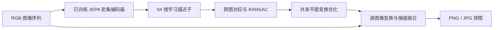

# tinyStitch：货架序列图片拼接

独立子项目，处理**单个货架一侧正面**的连续照片。复用 tinyLayout 的程序化商店几何和 Three.js 渲染器，自动生成沿货架横向移动的重叠 RGB 图片；也支持用户 JPG、PNG、WebP 文件。自动匹配、对齐和融合，导出 PNG、JPG、诊断 JSON，不要求手动选择匹配点。

只使用 RGB，不读取相机位姿、货架编号、场景种子或模拟真值。默认采用实际训练的 JEPA 描述子，需要 PyTorch 与交付的权重；优先使用 MPS，兼容 CPU。缺少有效权重时禁用 JEPA 拼接，不使用随机网络或静默退回 SIFT。输入完全断开时返回明确错误，不拼出伪完整结果。

## 启动

Node.js 20+、Python 3.12。模拟批量采样和网页验收还需要本机 Chrome。

本子项目共享上一级 `src/sim/store.ts`、`src/sim/renderer.ts` 和 `src/types.ts`，请保留 tinyLayout 目录结构，并安装上一级前端依赖：

```bash
# 在 tinyLayout 根目录
npm ci
cd tinyStitch
npm ci
uv --native-tls sync --frozen --extra test --python 3.12
bash scripts/dev.sh
```

网页 http://127.0.0.1:5180，后端 http://127.0.0.1:8010/docs。端口与布局实验 5173/8000 独立。

分别运行：

```bash
# 在 tinyStitch 目录
.venv/bin/python -m uvicorn backend.api:app --host 127.0.0.1 --port 8010
npm run dev
```

`dev.sh` 优先使用子项目 `.venv`，缺少时可复用上一级 `.venv312`。两个服务仅绑定本机。

## 使用

1. 默认随机生成 2–8 个模拟米的货架，生成 9 张 720×960 竖幅照片。货架长度和图片张数可分别选择“随机”（设置上下限）或“自定义”（输入固定值）；长度 1–12、图片 2–48 张。点击“生成拍摄”应用设置，骰子按钮使用新种子随机生成；同种子和同参数可复现。长货架增加商品列数并调整拍摄空间，较少照片会自动后退镜头维持覆盖，因此商品在图中可能更小。模拟路线检查整段拍摄位置不穿过墙或货架。相机有轻微高度、偏航和俯仰变化。
2. 默认选择“JEPA 学习特征（主流程）”，点击“生成完整拼图”，实际提交 RGB 序列并执行已训练模型与拼接。可查看各图连接的匹配数、内点数、几何残差与失败原因。
3. 或导入自己的 2–48 张连续照片，按文件名数字顺序排序。单张 ≤25 MB、总量 ≤300 MB。按顺序命名如 `0001.jpg`。手机 EXIF 方向自动校正；HEIC 请分享/导出为 JPEG。
4. 导出原始序列 ZIP、透明背景 PNG、白背景 JPG、变换与诊断 JSON。PNG 中边界缺失区域透明，不生成未拍摄内容。输出坐标是像素，不是米制。
5. 长任务可取消；服务重启后未完成任务标记为 interrupted。

拍摄时尽量与货架保持相近距离、横向移动，避免绕货架转弯；相邻照片建议 50%–70% 重叠。不要把多个货架、不同侧面、明显遮挡和不连续场景混在一组。清晰度低、重复商品、反光、近距离凸起商品可能导致匹配失败或重影。

“完整拼图”表示融合所有输入照片的**已拍到区域**。程序不识别完整货架的真实范围，不保证补全未拍到的边缘；结果可能包含背景。低残差仅表示特征匹配一致，不等于真实商品边缘全部对齐或拼图质量经过概率校准。

## 实现

- EXIF 校正，保持长宽比缩放到长边最多 1280。
- 轻量密集 CNN 编码器输出 stride=4、64 维特征。用 SIFT **仅检测关键点位置**，在 JEPA 特征图中双线性采样获得学习描述子；主流程不计算、拼接或回退到 SIFT 描述子。
- 双向最近邻比例检验、RANSAC 单应性估计。匹配当前图片后续最多 3 张，避免无约束全配对开销。SIFT 描述子保留为显式选择的传统对照。
- 检查内点数、内点比例、特征分布、透视奇异/翻折和尺度变化；构建图像连接图，要求全部照片连接到主体。
- 中间照片作为坐标锚点，最大权重连接初始化；优化全部有效连接的匹配残差，获得共享平面中的图像变换。
- 每个像素优先使用离该照片中心较近的视图，在约 10 像素窄接缝内融合并有限曝光补偿，减少宽范围平均带来的商品重影。
- 最大画布 1600 万像素、最长边 16000。只保留有图像覆盖的区域，不外推画面。超过限制或几何异常时给出错误。

这是自研 JEPA 思路的拼接实验，使用潜在表示预测与几何对应辅助训练，不宣称复现 Meta I-JEPA / V-JEPA，也不声称纯 JEPA 已解决像素级对应。单个平面无法完全解决真实货架的深度差与视差。后续可在采集真实数据后比较局部网格变形、学习式匹配和商品区域接缝优化。没有预设真实门店精度承诺。

JEPA 参考：[Meta JEPA 官方代码](https://github.com/facebookresearch/jepa)、[I-JEPA 论文](https://arxiv.org/abs/2301.08243)。官方几何方法参考：[OpenCV 特征匹配与单应性](https://docs.opencv.org/4.12.0/d1/de0/tutorial_py_feature_homography.html)、[OpenCV 拼接模型说明](https://github.com/opencv/opencv/blob/4.x/doc/tutorials/others/stitcher.markdown)。

## JEPA 训练与密集匹配

上下文 CNN 编码器读取被遮挡的图像块，卷积预测器预测对应位置的潜在特征；EMA 目标编码器读取另一个完整增强视图，目标分支停止梯度。使用 Smooth L1 潜在预测损失，以及特征方差与协方差约束。训练前 400 步只做 JEPA；后 1200 步保留 JEPA 损失并增加对应点 InfoNCE 辅助项。已知随机单应性仅用于制作训练增强的对应关系，不是推理输入。

不能直接用布局模型的 4×4 全局特征代替拼接描述子，因此为此任务单独训练密集编码器。没有使用 Meta 大模型或在线下载预训练权重。拼图来自真实源图像的变换与融合，JEPA 预测的潜在特征不会被解码成虚构商品。



```bash
# 在 tinyStitch 目录；网页运行后复用同一个渲染器
node scripts/generate.mjs --seed=910000 --count=56 --output=data/jepa-source
.venv/bin/python scripts/train_jepa.py --data=data/jepa-source --steps=1600 --batch=4
# 完整 checkpoint 保存优化器与 CPU / MPS RNG，可中断恢复
.venv/bin/python scripts/train_jepa.py --data=data/jepa-source --steps=1600 --batch=4 --resume
```

按独立布局划分：47 个训练布局（423 张）、9 个验证布局（81 张），验证固定采样 16 个增强对、覆盖全部验证布局，以对应点区分率选择 checkpoint。`artifacts/models/shelf-jepa.pt` 是真实训练的部署编码器；`shelf-jepa-latest.pt` 是包括目标网络、预测器、优化器和 RNG 的恢复文件。训练数据清单和损失曲线数据同目录保存。独立测试使用另生成的 920000–920011 布局，不参与选择权重或阈值。

对应点辅助项很重要：JEPA 潜在预测损失下降不等于能精确匹配重复商品。报告同时保留传统 SIFT 对照，不预设学习方法会超过它。

## 命令行与验证

```bash
# 在 tinyStitch 目录，按文件名顺序实际计算
.venv/bin/python -m backend.stitch examples/simulated/rgb --output=data/my-panorama --method=jepa

# 网页运行后生成同一渲染器的样本
node scripts/generate.mjs --seed=42 --output=examples/simulated
node scripts/generate.mjs --seed=920000 --count=12 --output=data/jepa-test
.venv/bin/python scripts/benchmark.py data/jepa-test --output=examples/validation/jepa --method=jepa
.venv/bin/python scripts/benchmark.py data/jepa-test --output=examples/validation/sift --method=sift
.venv/bin/python scripts/validate_jepa.py

.venv/bin/python -m pytest -q tests
npm run build
npm run test:e2e
```

`examples/simulated/rgb/` 是实际渲染的输入，`jepa-result/` 是 RGB-only JEPA 主流程的真实输出，`result/` 是 SIFT 对照输出，`generation/` 只保存模拟制作信息，删掉此目录仍可拼接。`benchmark.py` 在拼接完成后独立读取模拟制作信息，只用于检查同一货架正面物理点的跨图一致性，不将任何标签传入拼接函数。

测试覆盖 JEPA 目标分支无梯度、EMA 更新、缺少权重不回退、实际训练描述子与模型 SHA-256，以及已知图像区域的对齐与真实像素、改变输入后的重新计算、无纹理/断开输入错误、手机 EXIF、RGB-only API 契约和实际后台任务。浏览器验收覆盖生成 → 实际拼接 → 导出 → 图片导入 → 重新拼接及手机宽度无溢出。

## API

| 接口 | 用途 |
|---|---|
| `POST /api/captures` | 仅 `frames` RGB data URLs → 输入 ID |
| `POST /api/uploads` | multipart `files` → 输入 ID、预览 |
| `POST /api/stitch` | **仅 `rgb_id`、`method`** → 任务 ID，多余位姿/标签字段拒绝 |
| `GET /api/jobs/{id}` | 任务状态、进度、错误、结果链接 |
| `POST /api/jobs/{id}/cancel` | 取消任务 |
| `GET /api/inputs/{id}/download` | 原始 RGB ZIP |
| `GET /api/files/{id}/panorama.png` | PNG 拼图，JPG/报告同目录 |

数据默认在子项目 `data/`，可通过 `tinyStitch_DATA` 指定独立目录。项目沿用上一级 Apache-2.0 许可，依赖保留各自许可证。

## 本次实际实验结果

已实际完成 1600 步训练（47 个训练布局、9 个验证布局），M4 MPS 约 2.28 分钟。部署编码器 76,448 参数。独立测试 12 个新布局，每组 9 张图片，JEPA 与 SIFT 都成功 12/12。

| 方法 | 每组平均耗时 | 正面平面点误差中位数 |
|---|---:|---:|
| JEPA 学习描述子 | 1.62 秒 | 0.038 px |
| SIFT 描述子对照 | 1.06 秒 | 0.029 px |

本次测试中 JEPA 更慢，几何误差略大，未显示优于 SIFT。误差来自有标签、轻微镜头抖动的简化合成货架正面，仅用于跨图几何检查，不代表真实照片、背景或凸起商品的误差；两者均未做真实门店测试。没有隔离消融，不能把结果全部归因于 JEPA。耗时包括加载、模型/特征、拼接与输出，首个任务含冷启动。详见 [完整实际报告](artifacts/report.html)、[机器可读报告](artifacts/report.json)。

已通过 7 个后端测试与实际网页闭环：生成 RGB → 调用训练 JEPA → 拼图 → 导出 → 图片导入 → 重新调用；更换输入产生新摘要，推理移除模拟制作信息后仍可运行。

## 自定义与随机批量生成

```bash
# 固定货架长度与图片张数；--count 仍表示场景数
node scripts/generate.mjs --seed=42 --length=6 --frames=12 --output=data/custom-shelf
# 分别设置随机范围，每个种子可复现
node scripts/generate.mjs --seed=100 --count=10 --length=random --length-min=2 --length-max=10 --frames=random --frames-min=8 --frames-max=20 --output=data/random-shelves
```

不传 `--length` / `--frames` 时保持原来的商店生成方式和 9 帧，已有训练样本仍可复现。改变参数后使用新的输出目录，生成器会拒绝覆盖配置或图片数量不同的已有序列，避免混入旧图片。定制拍摄的真实长度、实际帧数和估计重叠保存在模拟制作 JSON，拼接 API 仍然只接收 RGB。长度单位仅用于模拟设置，不表示从真实照片测得米制尺寸。

现有 JEPA 权重保持不变；上面的独立测试报告基于原始生成配置，不代表新增长度与张数范围的系统精度评估。
