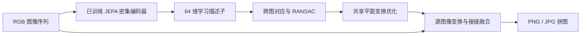

# tinyStitch：货架序列图片拼接

独立子项目，处理**单个货架一侧正面**的连续照片。使用项目内的程序化货架几何和 Three.js 渲染器，自动生成沿货架横向移动的重叠 RGB 图片；也支持用户 JPG、PNG、WebP 文件。自动匹配、对齐和融合，导出 PNG、JPG、诊断 JSON，不要求手动选择匹配点。

只使用 RGB，不读取相机位姿、货架编号、场景种子或模拟真值。默认采用实际训练的 JEPA 描述子，需要 PyTorch 与交付的权重；优先使用 MPS，兼容 CPU。缺少有效权重时禁用 JEPA 拼接，不使用随机网络或静默退回 SIFT。输入完全断开时返回明确错误，不拼出伪完整结果。

## 启动

Node.js 20+、Python 3.12。模拟批量采样和网页验收还需要本机 Chrome。

模拟器、类型和渲染器已独立放入 `src/sim/` 与 `src/types.ts`，不需要上一级 tinyLayout 项目：

```bash
# 在 tinyStitch 根目录
npm ci
uv --native-tls sync --frozen --extra test --python 3.12
bash scripts/dev.sh
```

网页 http://127.0.0.1:5180，后端 http://127.0.0.1:8010/docs。端口与布局实验 5173/8000 独立。

分别运行：

```bash
# 在 tinyStitch 目录
.venv/bin/python -m uvicorn backend.api:app --host 127.0.0.1 --port 8010
npm run dev
```

`dev.sh` 优先使用子项目 `.venv`，缺少时可复用上一级 `.venv312`。两个服务仅绑定本机。

## 使用

1. 默认随机生成 2–8 个模拟米的货架，生成 9 张 720×960 竖幅照片。货架长度和图片张数可分别选择“随机”（设置上下限）或“自定义”（输入固定值）；长度 1–12、图片 2–48 张。点击“生成拍摄”应用设置，骰子按钮使用新种子随机生成；同种子和同参数可复现。长货架增加商品列数并调整拍摄空间，较少照片会自动后退镜头维持覆盖，因此商品在图中可能更小。模拟路线检查整段拍摄位置不穿过墙或货架。相机有轻微高度、偏航和俯仰变化。
2. 默认选择“JEPA 学习特征（主流程）”，点击“生成完整拼图”，实际提交 RGB 序列并执行已训练模型与拼接。可查看各图连接的匹配数、内点数、几何残差与失败原因。
3. 或导入自己的 2–48 张连续照片，按文件名数字顺序排序。单张 ≤25 MB、总量 ≤300 MB。按顺序命名如 `0001.jpg`。手机 EXIF 方向自动校正；HEIC 请分享/导出为 JPEG。
4. 导出原始序列 ZIP、透明背景 PNG、白背景 JPG、变换与诊断 JSON。PNG 中边界缺失区域透明，不生成未拍摄内容。输出坐标是像素，不是米制。
5. 长任务可取消；服务重启后未完成任务标记为 interrupted。

拍摄时尽量与货架保持相近距离、横向移动，避免绕货架转弯；相邻照片建议 50%–70% 重叠。不要把多个货架、不同侧面、明显遮挡和不连续场景混在一组。清晰度低、重复商品、反光、近距离凸起商品可能导致匹配失败或重影。

“完整拼图”表示融合所有输入照片的**已拍到区域**。程序不识别完整货架的真实范围，不保证补全未拍到的边缘；结果可能包含背景。低残差仅表示特征匹配一致，不等于真实商品边缘全部对齐或拼图质量经过概率校准。

## 实现

- EXIF 校正，保持长宽比缩放到长边最多 1280。
- 轻量密集 CNN 编码器输出 stride=4、64 维特征。用 SIFT **仅检测关键点位置**，在 JEPA 特征图中双线性采样获得学习描述子；主流程不计算、拼接或回退到 SIFT 描述子。
- 双向最近邻比例检验、RANSAC 单应性估计。匹配当前图片后续最多 3 张，避免无约束全配对开销。SIFT 描述子保留为显式选择的传统对照。
- 检查内点数、内点比例、特征分布、透视奇异/翻折和尺度变化；构建图像连接图，要求全部照片连接到主体。
- 中间照片作为坐标锚点，最大权重连接初始化；优化全部有效连接的匹配残差，获得共享平面中的图像变换。
- 每个像素优先使用离该照片中心较近的视图，在约 10 像素窄接缝内融合并有限曝光补偿，减少宽范围平均带来的商品重影。
- 最大画布 1600 万像素、最长边 16000。只保留有图像覆盖的区域，不外推画面。超过限制或几何异常时给出错误。

这是自研 JEPA 思路的拼接实验，使用潜在表示预测与几何对应辅助训练，不宣称复现 Meta I-JEPA / V-JEPA，也不声称纯 JEPA 已解决像素级对应。单个平面无法完全解决真实货架的深度差与视差。后续可在采集真实数据后比较局部网格变形、学习式匹配和商品区域接缝优化。没有预设真实门店精度承诺。

JEPA 参考：[Meta JEPA 官方代码](https://github.com/facebookresearch/jepa)、[I-JEPA 论文](https://arxiv.org/abs/2301.08243)。官方几何方法参考：[OpenCV 特征匹配与单应性](https://docs.opencv.org/4.12.0/d1/de0/tutorial_py_feature_homography.html)、[OpenCV 拼接模型说明](https://github.com/opencv/opencv/blob/4.x/doc/tutorials/others/stitcher.markdown)。

## JEPA 训练与密集匹配

上下文 CNN 编码器读取被遮挡的图像块，卷积预测器预测对应位置的潜在特征；EMA 目标编码器读取另一个完整增强视图，目标分支停止梯度。使用 Smooth L1 潜在预测损失，以及特征方差与协方差约束。训练前 400 步只做 JEPA；后 1200 步保留 JEPA 损失并增加对应点 InfoNCE 辅助项。已知随机单应性仅用于制作训练增强的对应关系，不是推理输入。

不能直接用布局模型的 4×4 全局特征代替拼接描述子，因此为此任务单独训练密集编码器。没有使用 Meta 大模型或在线下载预训练权重。拼图来自真实源图像的变换与融合，JEPA 预测的潜在特征不会被解码成虚构商品。



```bash
# 在 tinyStitch 目录；网页运行后复用同一个渲染器
node scripts/generate.mjs --seed=910000 --count=56 --output=data/jepa-source
.venv/bin/python scripts/train_jepa.py --data=data/jepa-source --steps=1600 --batch=4
# 完整 checkpoint 保存优化器与 CPU / MPS RNG，可中断恢复
.venv/bin/python scripts/train_jepa.py --data=data/jepa-source --steps=1600 --batch=4 --resume
```

按独立布局划分：47 个训练布局（423 张）、9 个验证布局（81 张），验证固定采样 16 个增强对、覆盖全部验证布局，以对应点区分率选择 checkpoint。`artifacts/models/shelf-jepa.pt` 是真实训练的部署编码器；`shelf-jepa-latest.pt` 是包括目标网络、预测器、优化器和 RNG 的恢复文件。训练数据清单和损失曲线数据同目录保存。独立测试使用另生成的 920000–920011 布局，不参与选择权重或阈值。

对应点辅助项很重要：JEPA 潜在预测损失下降不等于能精确匹配重复商品。报告同时保留传统 SIFT 对照，不预设学习方法会超过它。

## 命令行与验证

```bash
# 在 tinyStitch 目录，按文件名顺序实际计算
.venv/bin/python -m backend.stitch examples/simulated/rgb --output=data/my-panorama --method=jepa

# 网页运行后生成同一渲染器的样本
node scripts/generate.mjs --seed=42 --output=examples/simulated
node scripts/generate.mjs --seed=920000 --count=12 --output=data/jepa-test
.venv/bin/python scripts/benchmark.py data/jepa-test --output=examples/validation/jepa --method=jepa
.venv/bin/python scripts/benchmark.py data/jepa-test --output=examples/validation/sift --method=sift
.venv/bin/python scripts/validate_jepa.py

.venv/bin/python -m pytest -q tests
npm run build
npm run test:e2e
```

`examples/simulated/rgb/` 是实际渲染的输入，`jepa-result/` 是 RGB-only JEPA 主流程的真实输出，`result/` 是 SIFT 对照输出，`generation/` 只保存模拟制作信息，删掉此目录仍可拼接。`benchmark.py` 在拼接完成后独立读取模拟制作信息，只用于检查同一货架正面物理点的跨图一致性，不将任何标签传入拼接函数。

测试覆盖 JEPA 目标分支无梯度、EMA 更新、缺少权重不回退、实际训练描述子与模型 SHA-256，以及已知图像区域的对齐与真实像素、改变输入后的重新计算、无纹理/断开输入错误、手机 EXIF、RGB-only API 契约和实际后台任务。浏览器验收覆盖生成 → 实际拼接 → 导出 → 图片导入 → 重新拼接及手机宽度无溢出。

## API

| 接口 | 用途 |
|---|---|
| `POST /api/captures` | 仅 `frames` RGB data URLs → 输入 ID |
| `POST /api/uploads` | multipart `files` → 输入 ID、预览 |
| `POST /api/stitch` | **仅 `rgb_id`、`method`** → 任务 ID，多余位姿/标签字段拒绝 |
| `GET /api/jobs/{id}` | 任务状态、进度、错误、结果链接 |
| `POST /api/jobs/{id}/cancel` | 取消任务 |
| `GET /api/inputs/{id}/download` | 原始 RGB ZIP |
| `GET /api/files/{id}/panorama.png` | PNG 拼图，JPG/报告同目录 |

数据默认在子项目 `data/`，可通过 `tinyStitch_DATA` 指定独立目录。项目沿用上一级 Apache-2.0 许可，依赖保留各自许可证。

## 本次实际实验结果

已实际完成 1600 步训练（47 个训练布局、9 个验证布局），M4 MPS 约 2.28 分钟。部署编码器 76,448 参数。独立测试 12 个新布局，每组 9 张图片，JEPA 与 SIFT 都成功 12/12。

| 方法 | 每组平均耗时 | 正面平面点误差中位数 |
|---|---:|---:|
| JEPA 学习描述子 | 1.62 秒 | 0.038 px |
| SIFT 描述子对照 | 1.06 秒 | 0.029 px |

本次测试中 JEPA 更慢，几何误差略大，未显示优于 SIFT。误差来自有标签、轻微镜头抖动的简化合成货架正面，仅用于跨图几何检查，不代表真实照片、背景或凸起商品的误差；两者均未做真实门店测试。没有隔离消融，不能把结果全部归因于 JEPA。耗时包括加载、模型/特征、拼接与输出，首个任务含冷启动。详见 [完整实际报告](artifacts/report.html)、[机器可读报告](artifacts/report.json)。

已通过 7 个后端测试与实际网页闭环：生成 RGB → 调用训练 JEPA → 拼图 → 导出 → 图片导入 → 重新调用；更换输入产生新摘要，推理移除模拟制作信息后仍可运行。

## 自定义与随机批量生成

```bash
# 固定货架长度与图片张数；--count 仍表示场景数
node scripts/generate.mjs --seed=42 --length=6 --frames=12 --output=data/custom-shelf
# 分别设置随机范围，每个种子可复现
node scripts/generate.mjs --seed=100 --count=10 --length=random --length-min=2 --length-max=10 --frames=random --frames-min=8 --frames-max=20 --output=data/random-shelves
```

不传 `--length` / `--frames` 时生成 9 帧。独立模拟器替代了缺失的外部 tinyLayout 实现，相同种子不再复现历史 tinyLayout 图像；历史权重和报告保留，当前生成结果必须重新评测。改变参数后使用新的输出目录，生成器会拒绝覆盖配置或图片数量不同的已有序列，避免混入旧图片。定制拍摄的真实长度、实际帧数和估计重叠保存在模拟制作 JSON，拼接 API 仍然只接收 RGB。长度单位仅用于模拟设置，不表示从真实照片测得米制尺寸。

现有 JEPA 权重保持不变；上面的独立测试报告基于原始生成配置，不代表新增长度与张数范围的系统精度评估。


## 三维研究分支（2026-10-05）

独立入口 `python -m backend.research.cli` 实现跨图像 JEPA、小型 ViT、位姿/深度头、空间 VAE、投影查询神经体渲染以及输入视图场景优化。平面拼接 API 没有变化。研究入口需要有序 RGB **和已知内参**，外参由模型预测；不读取 `labels/` 或 `heldout/`。输出为中间相机宽幅透视图、透明有效区域、预测相机、深度和诊断报告。尺度属于统一场景规范，不能解释为米。

研究数据使用 Python 三维盒体光线求交渲染，与网页 Three.js 模拟器独立。数据导出内参、OpenCV 世界到相机矩阵、线性相机 z 深度和留出视角。遮挡一致的真实投影对应参与双向 JEPA 预测。目标区域在两侧编码器中遮挡，EMA 分支无梯度；包含方差约束。渲染训练排除正在监督的源视图，避免直接复制目标像素。测试时只使用输入 RGB 优化位姿、深度尺度和场景残差。全局优化包含近邻位姿图先验、投影光度与深度一致性；这是稠密直接优化原型，没有显式三维关键点 BA。

```bash
# 安装研究依赖；也可使用 uv --native-tls sync --extra test --extra research
python3 -m pip install -e '.[test,research]'
python3 -m backend.research.cli generate --output data/research/my-run --scenes 12 --views 3
# 每阶段 steps 次；默认 256×192 数据、patch=8、dim=192、两层 ViT
python3 -m backend.research.cli train --data data/research/my-run --output artifacts/research/my-run --steps 100 --device mps
# 恢复必须提供相同模型参数、数据与消融参数
python3 -m backend.research.cli train --data data/research/my-run --output artifacts/research/my-run --steps 100 --device mps --resume artifacts/research/my-run/latest.pt
python3 -m backend.research.cli reconstruct --input data/research/my-run/730005 --checkpoint artifacts/research/my-run/model.pt --output data/research/result --device mps --width 1024 --optimize 20
python3 -m backend.research.evaluate --data data/research/my-run --checkpoint artifacts/research/my-run/model.pt --output artifacts/research/my-evaluation --device cpu
```

输入目录包含 `rgb/0000.png` 等有序图片和 `intrinsics.json`（`K` 为按图片顺序的 3×3 内参列表，`width`、`height` 为原图尺寸）。同一序列图片尺寸必须一致；没有内参或完整训练检查点时明确失败。离线生成数据至少 6 个场景，按场景种子分割；图像尺寸须为 8 的倍数。

训练顺序为 JEPA、位姿/深度、VAE、真值相机渲染、预测相机渲染、联合微调。`latest.pt` 保存优化器、CPU/MPS/Python/NumPy RNG 和阶段进度，`model.pt` 是最后阶段权重；当前不根据验证集选择最佳权重。使用 `--single-scene` 做单场景拟合探针，`--same-image` 与 `--no-vae` 分别训练消融。重建的 `--optimize 0 --no-global-opt` 保留纯前馈结果，`--no-vae` 禁用外观潜变量。MPS 使用显式可微双线性采样，避免当前 PyTorch grid_sample 反向算子缺失。

已实际运行 12 个场景（8 训练、2 验证、2 测试）、各阶段 10 步的小规模实验，同时训练同图与无 VAE 对照；另完成 MPS 小模型闭环和单场景 30 步/阶段拟合探针。它们属于运行验证，训练量不足以证明跨视图对应优势或消除真实重影。对比图仍存在模糊、纹理错位及覆盖缺口。传统基线在重复纹理测试场景中失败，同图消融部分指标更好；不得据此宣称新架构优于传统方法。

评测只在各方法有效且真值可见区域计算 PSNR/SSIM，并单独报告覆盖率；LPIPS 使用遮罩后的整图。这些区域在方法间可能不同，因此不可直接作为公平排名。传统拼图成功时通过中间视图中值深度平面映射到同一目标相机，保留平面假设；失败则记录原因，禁止伪造指标。真值相机消融使用**预测深度**，只隔离相机因素。DTU/BlendedMVS 接入、真实标定照片与正式统计检验尚未开展。

实际结果与限制见 `artifacts/research/RESULTS.md`。检查点保留在本机 `artifacts/research/` 并由 Git 忽略；运行命令可重建权重。历史 `artifacts/models/shelf-jepa.pt` 未修改。


## 单场景过拟合验证

新增 `python -m backend.research.cli overfit`。固定曝光的三维货架上，JEPA＋明确标注的对应监督辅助项、位姿/深度头、VAE分别拟合，再比较真值几何和预测几何的体渲染。可选 Fourier 渲染器与亚像素深度头保留旧架构兼容性；源深度引导采样不读取目标 RGB 或目标深度。

已实际完成两轮：旧渲染器约 23 dB，改进后预测几何分支三张训练图达到 **31.40 / 30.25 / 31.17 dB**，均通过预设 30 dB 门槛；留出视角只有 **20.82 dB**，未通过 25 dB 门槛。仅证明单场景训练拟合能力，不能宣称整个 NVS 路线或纯 JEPA 已验证。辅助对应误差中位数约 1.45 px，深度相对误差约 0.82%；模型并非跨场景可用权重。

新检查点可用于普通重建入口，已实际验证只含 RGB 与内参的目录（没有 `labels/`、`heldout/`）能输出全景。默认历史检查点仍使用原有均匀采样；新检查点通过 `ray_sampling=depth_guided` 记录采样方式，不能混用未声明的采样配置。过拟合检查点记录 `joint=0`，因为本实验没有执行端到端联合微调。

详细固定掩码指标、原始曲线、图像与复现命令见 [单场景报告](artifacts/research/OVERFIT.md)。


## 正面正交输出

研究重建入口现在默认 `--projection orthographic`。目标光线平行，原点随像素移动；同尺寸商品不会因深度变化产生透视缩放。源相机仍按透视模型投影查询。目标朝向由预测深度的稳健表面法线估计，范围由正面几何确定，不读取模拟标签。`--projection perspective` 可显式恢复原输出；历史透视留出评测显式使用透视模式。

实际运行：
```bash
.venv/bin/python -m backend.research.cli reconstruct --input data/research/overfit-rgb-only --checkpoint artifacts/research/overfit-guided-v2/model.pt --output artifacts/research/overfit-guided-v2/orthographic --device cpu --width 256 --optimize 0 --no-global-opt --samples 64
```
输出 `orthographic/panorama.png` 和诊断 JSON；实际覆盖率 97.21%，耗时 9.13 秒。该覆盖率不是图像准确率。当前输出仍有纹理噪声与边缘伪影，正交投影已实现，留出视角质量问题仍待解决。所有商品正面平行是当前货架场景的条件；任意旋转商品不会仅通过改变相机变为正面。


## 不透明正交 GT 拟合

`generate` 现在同时导出 `orthographic/rgb.png`、`mask.png` 和 `geometry.npz`（正交像素尺度、世界到相机变换、线性深度）。复用同一三维货架盒体、商品位置和光线求交，保留层板遮挡。已逐像素确认场景重构代码重构后，原有三张透视源图保持一致。

新增独立容量实验：
```bash
.venv/bin/python -m backend.research.cli orthofit --scene data/research/overfit-controlled/731000 --checkpoint artifacts/research/orthographic-gt-v1/model.pt --output artifacts/research/orthographic-opaque-v1 --steps 3000 --width 256
```
该实验明确使用合成正交 RGB、相机和深度进行监督；源视图几何仍为模型预测。全部 GT 正深度像素参与损失与评分，预测支持率另外记录。它不属于留出视角评测。目标相机坐标规范通过合成标签转换，不能将本实验输出宣称为无需标签的推理结果。

新增 `opaque_surface` 检查点配置：每条受支持光线以前向单表面选择输出颜色；柔性权重仅提供训练梯度代理。不会把商品 RGB 与后方 RGB 混成半透明材料。无几何支持光线保持无效，输出 PNG 的透明通道表示覆盖区域。旧检查点保留原渲染模式以便对照。

后续不透明实验增加 `hybrid` 采样：一半源深度引导样本，一半全深度范围样本，避免仅有局部采样时漏掉凹入背板。`orthofit` 默认采用该配置并写入检查点。`--source-geometry oracle` 仅用于真值源几何诊断，默认仍为 `predicted`。

合成数据默认使用 `solid_labels`：商品实色包装与局部标签，货架独立实色，不再使用商品和背景共用的世界坐标棋盘纹理。旧数据集保留原材质；正交 GT 按 manifest 中的材质重新生成，避免只改 GT 而保持源图不变。可用 `orthofit --adapt-steps 600` 在训练场景标签上适配位姿/深度与空间VAE，详情见 [正交实验](artifacts/research/ORTHOGRAPHIC.md)。

实色货架进一步完成表面监督、边缘采样与冻结密度的颜色细化：固定全部GT有效区域PSNR **30.70 dB**，边缘 **33.53 dB**、内部 **30.02 dB**，目标深度AbsRel **1.49%**。这是正交GT参与训练的单场景拟合结果；当前几何支持率80.31%，未证明留出视角或跨场景泛化。新检查点 `artifacts/research/solid-color-refine-v1/model.pt`，详细命令与失败分支见 [实验报告](artifacts/research/ORTHOGRAPHIC.md)。

可选 `orthofit --deepen --freeze-density` 增加零初始化残差颜色分支，配置记录为 `field_arch=deep_fourier`。同一初始检查点、GT、采样序列与4000步预算下，浅层33.64 dB，加深34.63 dB；目标深度误差保持1.49%。这仍为GT参与训练的单场景拟合结果，详见 [同预算实验](artifacts/research/ORTHOGRAPHIC.md)。

## 10–60张原生照片试跑

新增 `generate-native` 与 `multiview` CLI。实际完成10、30、60张1280×960原生合成照片，保留原生RGB/VAE，几何工作分辨率256×192，输出256×166。流程可执行，但旧三图权重的位姿累计漂移严重：序列跨度预测/GT约3.21/8.90/13.70倍，尚不适用产线。128×96只保留为快速排查设置，不能当作产线画质验收。详见 [原生多图两阶段报告](artifacts/research/native-multiview-v1/REPORT.md)。

重建入口对宽度超过256的原图默认分离几何工作分辨率，或显式指定 `--geometry-width 256`；颜色投影使用原生RGB，源内参保持原生尺度。当前工作分辨率和旧权重尚未做多分辨率适配。


## 多图位姿与深度适配（2026-10-07）

新增 `pose-adapt` 与 `depth-adapt` CLI，四训练场景/一验证/一测试场景，源图直接重渲染到256×192。位姿使用双向变化间距样本、关系MLP和相邻边全局一致性；深度在工作分辨率下单独适配。JEPA、VAE和渲染场冻结，1280×960源RGB继续保留。旧权重和API没有替换。

独立测试货架10/30/60张的序列跨度从3.08/8.61/13.86×降为1.14/1.17/1.32×，深度AbsRel从8.17%降至2.80%。原生输入受控正交渲染PSNR约15.91/16.03/16.12 dB，仍有明显伪影，尚未通过画质验收。未见场景10张256×192照片的正交PSNR为15.62 dB，另行报告。

新检查点：`artifacts/research/depth-multiscene-v1/model.pt`。训练、全局图消融、失败渲染控制、实际图像和复现命令见[两阶段优化报告](artifacts/research/pose-depth-optimization-v1/REPORT.md)。36项测试通过。

## 分阶段一致性与渲染优化（2026-10-07）

新增跨视图深度一致性、遮挡边缘监督和 `render-adapt` 多数量训练；原生RGB与工作尺度空间VAE明确分开。独立测试源深度AbsRel从2.80%降至2.64%，10/30/60输入的V3正交PSNR为16.33/17.04/16.33 dB。像素中心对齐V4提升部分SSIM但PSNR略降；仅输入光度优化改善相机中心却恶化旋转与深度，均保留对照。仍有明显伪影，未通过画质验收。

42项测试通过，并完成MPS上10张1280×960、仅RGB＋内参的推理。测试目标GT没有进入拟合；训练场景正交GT明确用于渲染监督。完整两阶段指标、图像、失败分支与复现命令见[本轮报告](artifacts/research/staged-optimization-v2/REPORT.md)。旧权重和 `/api/stitch` 保持原状。

## 长货架与全局特征优化（2026-10-07）

生成器新增 `--capture-step`，固定相邻间距并随帧数增加货架长度和商品列数；10/30/60张对应3.86/6.66/10.86m合成货架。已完成256×192工作尺度及60张1280×960原生控制。新增局部源视图查询、长货架正交GT训练、`homography-benchmark`（现有SIFT/JEPA估计H）和 `global-pose-adapt` 全序列特征注意力。

在独立60张长货架上，全局特征将跨度1.058→1.031倍、最大旋转2.57°→1.19°；同一冻结渲染器的原生输入PNG PSNR14.78→15.26 dB，但SSIM仍只有0.175，累计变形和噪声未完全消除。传统拼图在部分数量下的SSIM更好，原生60张JEPA匹配断连。47项测试通过，MPS已执行仅RGB＋内参的全局模型推理。完整两阶段结果、原始/适配单应拼图、局部放大和复现命令见[长货架报告](artifacts/research/long-shelf-selected-v2/REPORT.md)。所有候选和原有模型保留，网页API未替换。

## 第一阶段单应矩阵累计变形优化

新增独立 `homography-global`，使用全序列层板行结构和共享尺度基底优化源图单应变换，不调用神经渲染、不用PSNR/SSIM评分。独立60张SIFT层板残差4.46→0.45px、商品表面投影误差22.42→5.50px；局部残差略增且背板误差上升。该候选限于固定内参、近正面横扫，保留传统策略和失败对照。详情见[第一阶段报告](artifacts/research/homography-global-v1/REPORT.md)。

## 多层数、分组商品与货架朝向约束（第一阶段）

新增 `generate --varied-layout --capture-tilt`、`matching-adapt` 和 `homography-global --model orientation`。两套24场景包含2–6层、成组及整排同款商品；完成MPS匹配训练与独立60帧评测。朝向由标定消失方向估计，旋转序列全局正则后联合优化平移，拟合只用RGB与内参。

偏转场景的商品误差：SIFT共享基底16.68→朝向方案10.71px，JEPA19.24→13.56px；朝向均误差0.75°。整排重复商品仍有严重误关联，不能宣称已解决；本轮不评估第二阶段神经渲染或正交画质。53项测试通过，独立权重保留在 `artifacts/research/grouped-matching-v1`。数据协议、全部结果、低置信度与复现命令见[本轮报告](artifacts/research/grouped-layout-eval-v1/REPORT.md)。

## 第一阶段重复商品关联改进

新增 `homography-global --model orientation-consensus`：从观测推断稠密横扫的运动共识，筛除重复商品跳位，并补充经过前后向检查的相邻帧光流边。冻结权重，在相同六个独立60帧偏转场景上，商品均误差SIFT10.71→6.54px、JEPA13.56→6.89px；整排同款分别24.68→5.47px、33.50→5.85px。12次评测完成，55项测试通过。

此结果依赖近似匀速的有序稠密采集；仍有视差及背板精度代价，未验证原生分辨率和真实产线。仅优化第一阶段，默认API不变。[完整报告与复现命令](artifacts/research/sequence-consensus-v1/REPORT.md)。

## 同一条货架内不同子货架层数

新增 `generate --mixed-bays`：每场景5个子货架，各自2–6层、独立层高与商品分组；24场景×60帧，新数据在 `data/research/mixed-bays-v1`。完成1200步MPS匹配训练和1500步正交GT监督容量训练。`orientation-local`取消不同子货架共享层板高度的残差；局部渲染训练缓存修复为按列选择源视图，再恢复像素顺序。

训练场景正交PSNR20.18dB；未见场景原神经位姿渲染9.17dB，接入源图全局对齐提升的近似相机位姿后16.85dB，真值源几何对照17.75dB。提升方法需固定距离横扫和预测前景深度，不恢复米制尺度；仍有明显伪影，不是泛化/画质验收通过。新 `alignment-export` 导出不含GT几何的位姿输入，`multiview --alignment`仅替换源相机以做受控评估。58项测试通过，旧权重与默认API保留。[数据、两阶段报告与图像](artifacts/research/mixed-bays-v1/REPORT.md)。

## 不同子货架层数：深度、渲染与尺度解耦

完成12训练/6验证场景的深度与渲染适配。新增冻结源深度校准分支，避免更新深度头时改变全序列相机尺度；两场60帧配对测试正交PSNR从16.85/16.72提升至17.23/17.18 dB，相机输出保持一致。仍有明显局部噪声和错位，未通过产线画质验收；测试诊断后修复还需要全新场景复核。稳定权重在 `artifacts/research/mixed-bays-stable-combined-v1/model.pt`，默认API与旧权重保留。[两阶段指标、失败消融及复现命令](artifacts/research/mixed-bays-optimization-v1/REPORT.md)。

## 第一阶段深度几何优化（2026-10-08）

新增多尺度log深度差监督并完成同起点、同1800步预算对照。6个测试场景平均AbsRel：原模型3.294%、继续训练3.197%、多尺度分支3.168%；边界误差3.799%→3.701%，但同预算对照3.688%更低，遮挡边缘问题仍未解决。仅优化深度头，验证了相机/VAE/渲染器与冻结尺度校准分支未改变；未评估第二阶段。63项测试通过。[第一阶段报告与复现命令](artifacts/research/mixed-bays-geometry-optimization-v2/REPORT.md)。
